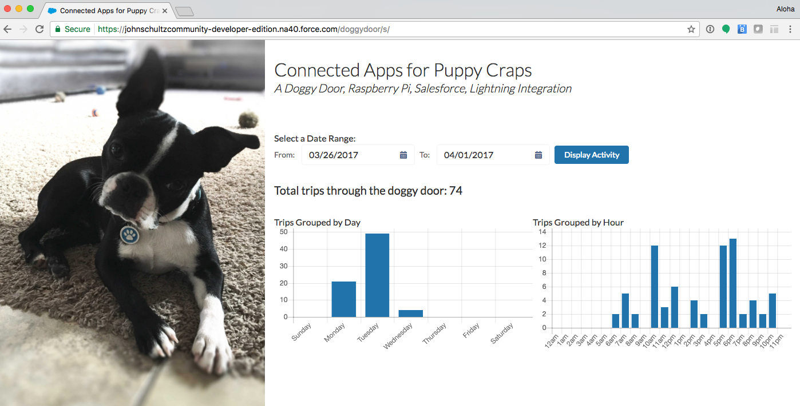

# Connected Apps for Puppy Craps
My puppy used to ring a bell when she needed to go out. She rang it a lot, and I got lazy. So, I installed a doggy door. At first she was afraid of the doggy door and only reluctantly used it, but the bell ringing stopped. And suddenly I realized that, without her ringing the bell, I had no clue if she was actually going outside to go to the bathroom. Naturally, the only thing I could possibly do to solve this mystery was to whip together a doggy door tracker with a magnetic sensor, Raspberry Pi, Salesforce Connected App, Salesforce Community, and some Salesforce Lightning Components.



This project polls a door sensor to see if it's open. If the door just changed states from closed to open, then the script will log into a Salesforce Connected App and create a new Doggy Door Activity record. If the door is open for longer than 5 minutes, then that means either my dog is stuck in the door or the door didn't shut all the way. Either way, I would want to know. And so the script will send out an email to me to let me know the door has been open longer than 5 minutes. The script also emails me if there were any errors creating the Salesforce records. And on the Salesforce side of things, I've created a bunch of Lightning components for displaying those activity records on a Community page.

## Demo
[http://johnschultz.rock/doggydoor](http://johnschultz.rocks/doggydoor)

## Getting Started

This project involves two main ingredients: A Raspberry Pi with a door sensor and a Salesforce org with a Community and Connected App.

### Salesforce

On the Salesforce side of things, the org needs to have the sObject Doggy Door Activity with all the fields listed in the /sfdc/src/Doggy\_Door\_Activity\_\_c.object metadata file.

You'll need to [set up a Connected App](https://help.salesforce.com/articleView?id=connected_app_create.htm) within your Salesforce org, and allow it to use refresh tokens during authentication.

I created a new user with a profile that only allows API access. And for that user, [I generated my Oauth tokens using this workaround](http://stackoverflow.com/a/22646414).

If you want to display the info in a Community page, then you'll also need to [create a Community](https://help.salesforce.com/articleView?id=networks_creating.htm), as well as a page that you can drag and drop the included Lightning components into from within the Community Builder. The screenshot above uses a custom lightning layout template that I've included in the repo.

### Raspberry Pi

The Raspberry Pi needs to be running node.js. The version that comes with the Pi doesn't work with the GPIO module, and therefore you need to uninstall it and install from the source.

```
sudo apt-get remove nodered -y
sudo apt-get remove nodejs nodejs-legacy -y
sudo apt-get remove npm -y
sudo su -
curl -sL https://deb.nodesource.com/setup_7.x | bash -
apt-get install -y nodejs
exit
```

The script relies on 3 javascript libraries:

* [jsforce](https://jsforce.github.io/) \- For connecting to Salesforce and creating the records
* [rpi-gpio](https://github.com/JamesBarwell/rpi-gpio.js) \- For working with the Pi's GPIO pins from within node
* [emaijs](https://github.com/eleith/emailjs) \- For sending out email notifications

```
npm install jsforce
npm install rpi-gpio
npm install emailjs
```

You'll need to edit /pi/doggydoor.js to fill in the blanks and customize variables for the following lines:

```
// GPIO pin number
const GPIO_PIN = 7;

// how frequently (in milliseconds) should the door be checked
const CHECKER_FREQUENCY = 400;

// salesforce variables
const SOBJECT_NAME = 'Doggy_Door_Activity__c';
var sfdc = {
	clientId : '',
	clientSecret : '',
	redirectUri : '',
	instanceUrl : '',
	accessToken : '',
	refreshToken : ''
};

// gmail variables
const EMAIL_TO_NOTIFY = ''; // email address of where the notifications should be sent.
const EMAIL_SENDER = ''; // email address of where the notifications should come from.
var gmail = email.server.connect({
	user : '', // email address
	password : '',
	host : '',
	ssl : true
});
```

Once all of that has been customized and saved to the Pi, you'll start the script with

```
sudo nodejs /path/to/the/script/doggydoor.js
```

